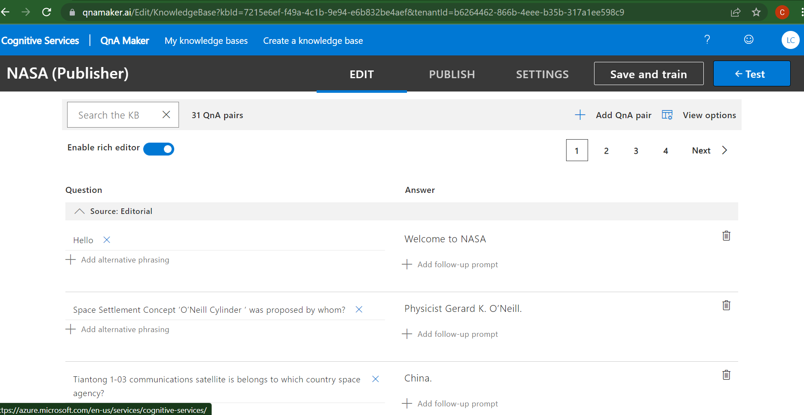
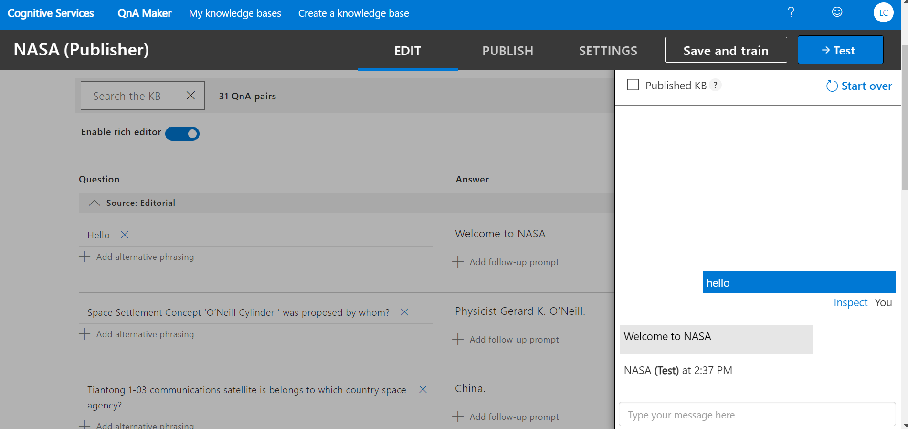
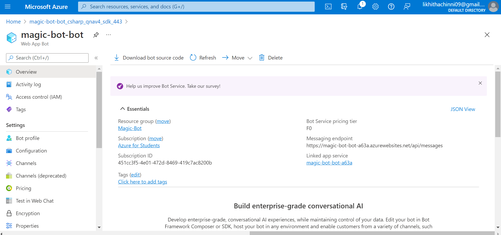
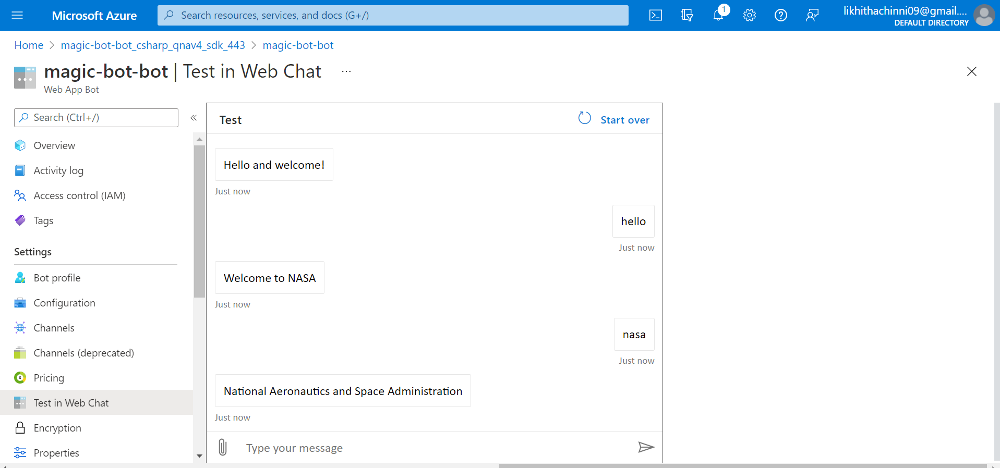

# FRT-PROJECT
Initially, I have created a knowledge Base using QNA maker Serivice

After giving the QNA pairs , I have saved and trained my knowledge base

After that I have tested my Bot

Then, i have published my chatbot to Web.

After successfully deploying the chat bot to web, I have tested the chatbot in test in web chat

The working link of my bot is https://webchat.botframework.com/embed/magic-bot-bot?s=-g5jEvocqrI.lt7P-20h3i2rbtUiTYgOVtbuGsRl2DExSD2Z3sLLpAE

Demo Link of my project https://drive.google.com/file/d/13YUJRLnWKO7JPgkqSGnC-kGPwJXAJvVI/view?usp=sharing
